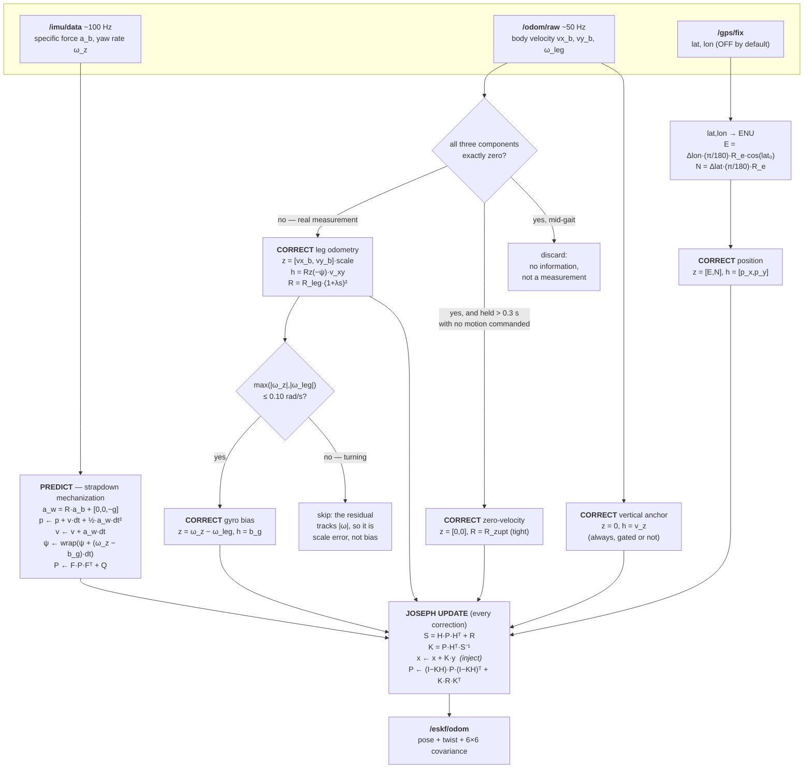

# go2_eskf

8-state **error-state EKF** for Unitree Go2 localization — fuses **IMU + leg
odometry + GPS**, with a slip-adaptive measurement-covariance model.

Like `ekf_estimator`, the math is a **ROS-free C++/Eigen core** (`eskf_core`)
so it unit-tests and cross-validates in isolation, wrapped by a thin ROS node.

## Status
- **Phase 1 ✅** — ESKF core, 16 GTest unit tests, NumPy reference +
  cross-validation harness (C++ ≡ NumPy to ~1e-14).
- **Phase 2 ✅** — live ROS node `eskf_node` (IMU predict, leg-odom + GPS
  corrections, ENU conversion, ground-truth logging). Robust `gravity_lp`
  attitude handling for the sim IMU; validated bounded on live data.
- **Phase 3 ✅** — slip-adaptive leg covariance: PyTorch trainer (+ NumPy
  fallback) → exported weights → dependency-free Eigen MLP (`slip_model.hpp`)
  inflating `R_leg`; 12 unit tests + C++≡NumPy slip cross-validation (~3e-16).
- **Phase 4 ✅** — benchmark suite: ATE/RPE/drift metrics with SE(2) alignment,
  fixed-vs-adaptive-vs-GPS-denied scenarios, auto-generated report + plots.

The remaining manual step is collecting real logs from a healthy walking-sim run
to populate the benchmark report with on-robot numbers. See
[`docs/DESIGN.md`](docs/DESIGN.md) §7–8.

---

# How the estimator works — physics, flow, and every equation

Everything below is transcribed from the code, not from a textbook: file and line
references point at the exact lines that implement each equation. The ROS-free core is
[`src/eskf_core.cpp`](src/eskf_core.cpp); the sensor plumbing and gating is
[`src/eskf_node.cpp`](src/eskf_node.cpp).

## 1. What is being estimated, and why only 8 states

$$
\mathbf{x} = \begin{bmatrix} p_x & p_y & p_z & v_x & v_y & v_z & \psi & b_g \end{bmatrix}^{\mathsf{T}}
$$

| index | symbol | meaning | frame | units |
|---|---|---|---|---|
| 0–2 | $p_x,p_y,p_z$ | position | world (ENU) | m |
| 3–5 | $v_x,v_y,v_z$ | velocity | world (ENU) | m/s |
| 6 | $\psi$ | yaw / heading | — | rad |
| 7 | $b_g$ | yaw-rate gyro bias | body | rad/s |

Roll $\phi$ and pitch $\theta$ are **inputs, not states**. Gravity is a permanent 1 g
reference vector that an accelerometer can see, so tilt is directly observable and there
is nothing slow or hidden to estimate. Heading has no such reference — the horizontal
component of gravity is zero by definition — so $\psi$ must be integrated and therefore
must be a state. The same argument makes $b_g$ a state: it is the slow error that
corrupts that integration. This is the standard reduction for a mostly-planar legged
robot ([`types.hpp:10`](include/go2_eskf/types.hpp)).

**"Error-state"** means the nonlinear nominal state is propagated exactly, while the
Kalman filter tracks only the small error $\delta\mathbf{x}$ about it and injects it back
after each correction. For yaw-only rotation the error is additive (SO(2)), so injection
is a plain `+=`; the structure generalizes to a multiplicative SO(3) error later.

## 2. The cycle



The **inject → reset** half of the ESKF recipe is the `x_ += K * y` line
([`eskf_core.cpp:121`](src/eskf_core.cpp)): the error is added into the nominal state and
the error is then implicitly zero again, which is why $\delta\mathbf{x}$ never appears as
a variable in the code.

## 3. Predict — the physics

An accelerometer does not measure acceleration; it measures **specific force**, the
non-gravitational force per unit mass. At rest it reads $+g$ upward. So converting to
world-frame acceleration means rotating and then *subtracting* gravity
([`eskf_core.cpp:61-62`](src/eskf_core.cpp)):

$$
\mathbf{a}_w = R(\phi,\theta,\psi)\,\mathbf{a}_b + \begin{bmatrix}0\\0\\-g\end{bmatrix},
\qquad g = 9.80665
$$

with the body→world rotation composed in the usual ZYX order
([`eskf_core.cpp:20-31`](src/eskf_core.cpp)):

$$
R = R_z(\psi)\,R_y(\theta)\,R_x(\phi)
$$

Sanity check: standing still, $\mathbf{a}_b = (0,0,g)$ and $R = I$, so
$\mathbf{a}_w = 0$ — no acceleration, as required.

Nominal propagation is constant-acceleration over the step
([`eskf_core.cpp:69-72`](src/eskf_core.cpp)):

$$
\begin{aligned}
\mathbf{p} &\leftarrow \mathbf{p} + \mathbf{v}\,dt + \tfrac{1}{2}\mathbf{a}_w\,dt^2 \\
\mathbf{v} &\leftarrow \mathbf{v} + \mathbf{a}_w\,dt \\
\psi &\leftarrow \mathrm{wrap}\big(\psi + (\omega_z - b_g)\,dt\big) \\
b_g &\leftarrow b_g \qquad \text{(random walk: mean unchanged)}
\end{aligned}
$$

### The transition Jacobian F

$F = \partial\,\delta\mathbf{x}_{k+1}/\partial\,\delta\mathbf{x}_k$ — how an error *now*
becomes an error *next step*. It is the identity plus four blocks
([`eskf_core.cpp:75-80`](src/eskf_core.cpp)):

$$
\frac{\partial \mathbf{p}}{\partial \mathbf{v}} = I_3\,dt,\qquad
\frac{\partial \mathbf{v}}{\partial \psi} = \frac{\partial R}{\partial \psi}\mathbf{a}_b\,dt,\qquad
\frac{\partial \mathbf{p}}{\partial \psi} = \tfrac{1}{2}\frac{\partial R}{\partial \psi}\mathbf{a}_b\,dt^2,\qquad
\frac{\partial \psi}{\partial b_g} = -dt
$$

Each has a physical reading. Velocity error becomes position error at rate $dt$. A
heading error mis-rotates the measured acceleration, so it *leaks into velocity* — this
is the term that makes yaw error and position error grow together. And bias error eats
directly into heading with a minus sign, because $\psi$ integrates $(\omega_z - b_g)$.

Only $R_z$ depends on $\psi$, so $\partial R/\partial\psi$ differentiates that factor
alone ([`eskf_core.cpp:33-44`](src/eskf_core.cpp)):

$$
\frac{\partial R}{\partial \psi} = \frac{dR_z}{d\psi}R_yR_x,\qquad
\frac{dR_z}{d\psi} = \begin{bmatrix} -\sin\psi & -\cos\psi & 0\\ \cos\psi & -\sin\psi & 0\\ 0&0&0\end{bmatrix}
$$

### Process noise Q

$\sigma_a,\sigma_g,\sigma_{bg}$ are **continuous-time densities**, so every term
integrates as $\sigma^2 dt$ — this is the standard white-noise-acceleration model,
including the position–velocity cross-term ([`eskf_core.cpp:91-105`](src/eskf_core.cpp)):

$$
Q_{pp} = I_3\frac{\sigma_a^2 dt^3}{3},\quad
Q_{pv} = Q_{vp} = I_3\frac{\sigma_a^2 dt^2}{2},\quad
Q_{vv} = I_3\,\sigma_a^2 dt,\quad
Q_{\psi\psi} = \big(\sigma_g^2 + (\sigma_{gs}\,\omega_z)^2\big)dt,\quad
Q_{bb} = \sigma_{bg}^2 dt
$$

$$
P \leftarrow F P F^{\mathsf{T}} + Q
$$

The $(\sigma_{gs}\omega_z)^2$ term is not textbook. The dominant yaw-rate error in this
sim is not white noise but a **scale error** ($\omega_{gyro}/\omega_{truth}$ measured
0.830 and 0.964 during turns), so heading uncertainty is made to grow in proportion to
how fast you are turning — precisely when the error enters. That is what lets a later
leg-odometry update pull heading back instead of being outvoted by an over-confident $P$.

## 4. How the H matrix is calculated

$H$ is the **measurement Jacobian**: it answers "if the state were wrong by
$\delta\mathbf{x}$, how would this sensor's reading change?" The rule is always the same
— write the *prediction of the measurement* $h(\mathbf{x})$, then differentiate it with
respect to every state, evaluated at the current nominal:

$$
\mathbf{y} = \mathbf{z} - h(\mathbf{x}), \qquad
H = \left.\frac{\partial h}{\partial \mathbf{x}}\right|_{\mathbf{x}}
$$

Three of the four sensors here have a trivial $h$, so their $H$ is just a selector row —
a 1 in the column of the state being measured, zeros elsewhere. Leg odometry is the
interesting one.

### Leg odometry — the only non-trivial H

CHAMP reports velocity in the **body** frame; the filter holds velocity in the **world**
frame. The prediction is therefore a rotation of the state into the sensor's frame
([`eskf_core.cpp:129-146`](src/eskf_core.cpp)):

$$
h(\mathbf{x}) = R_z(-\psi)\begin{bmatrix}v_x\\v_y\end{bmatrix},
\qquad
R_z(-\psi) = \begin{bmatrix}\cos\psi & \sin\psi\\ -\sin\psi & \cos\psi\end{bmatrix}
$$

Differentiating with respect to the two states it touches:

$$
\frac{\partial h}{\partial (v_x,v_y)} = R_z(-\psi)
\qquad\qquad
\frac{\partial h}{\partial \psi} = \frac{dR_z(-\psi)}{d\psi}\begin{bmatrix}v_x\\v_y\end{bmatrix}
= \begin{bmatrix}-\sin\psi & \cos\psi\\ -\cos\psi & -\sin\psi\end{bmatrix}\begin{bmatrix}v_x\\v_y\end{bmatrix}
$$

Assembled into the full $2\times 8$ matrix (columns in state order, · = zero):

$$
H_{\text{leg}} =
\begin{bmatrix}
\cdot & \cdot & \cdot & \cos\psi & \sin\psi & \cdot & -v_x\sin\psi + v_y\cos\psi & \cdot\\
\cdot & \cdot & \cdot & -\sin\psi & \cos\psi & \cdot & -v_x\cos\psi - v_y\sin\psi & \cdot
\end{bmatrix}
$$

**Two consequences worth internalizing.**

First, the yaw column is **proportional to speed**. Stand still and $v_x = v_y = 0$ makes
that column exactly zero: leg odometry carries *no* heading information when the robot is
not moving. Heading information is bought with motion.

Second, there is exactly one blind direction. Writing
$\frac{dR_z(-\psi)}{d\psi} = R_z(-\psi)\,S$ with $S = \begin{bmatrix}0&1\\-1&0\end{bmatrix}$,
the null condition $H\,\delta = 0$ becomes

$$
R_z(-\psi)\big(\delta\mathbf{v} + S\,\mathbf{v}\,\delta\psi\big) = 0
\quad\Longleftrightarrow\quad
\delta\mathbf{v} = \delta\psi\begin{bmatrix}-v_y\\ v_x\end{bmatrix}
$$

Rotating the heading and the world velocity *together* leaves the body-frame reading
identical — the sensor cannot tell. That is the exact sense in which heading is
unobservable from leg odometry alone. But note what it does **not** say: $H$ has 2 rows
over a 3-dimensional $(v_x,v_y,\psi)$ subspace, so only **one** direction is blind and
the orthogonal complement *is* measured. Every leg-odom update therefore applies a real
restoring pull on $\psi$ — it just cannot fix an error that has already rotated velocity
and heading together into the blind direction. Quantified over 40 seeds in
[`scripts/slip_yaw_experiment.py`](scripts/slip_yaw_experiment.py).

### The other three

| correction | measurement $z$ | prediction $h(\mathbf{x})$ | $H$ | code |
|---|---|---|---|---|
| **GPS position** | $(E, N)$ from lat/lon | $(p_x, p_y)$ | 1 in the $p_x$, $p_y$ columns | [`eskf_core.cpp:149`](src/eskf_core.cpp) |
| **Gyro bias** | $\omega_z^{\text{gyro}} - \omega_z^{\text{leg}}$ | $b_g$ | 1 in the $b_g$ column | [`eskf_core.cpp:158`](src/eskf_core.cpp) |
| **Vertical anchor** | $0$ | $v_z$ | 1 in the $v_z$ column | [`eskf_core.cpp:169`](src/eskf_core.cpp) |

The gyro-bias one is a genuine measurement, not a trick: leg kinematics estimate yaw rate
*without* a gyro, so the difference of the two is the bias plus noise,
$\omega^{\text{gyro}} - \omega^{\text{leg}} = b_g + n$. It is the main lever against
long-horizon heading drift when nothing measures heading absolutely.

The vertical anchor exists because $(p_z, v_z)$ is otherwise unobservable — the base bobs
but does not climb, so feeding $v_z \approx 0$ with a loose $R$ stops IMU residuals
double-integrating. Without it $p_z$ reached **1601 m** in testing.

## 5. The update

Every correction runs the same Joseph-form update
([`eskf_core.cpp:111-127`](src/eskf_core.cpp)):

$$
\begin{aligned}
S &= H P H^{\mathsf{T}} + R &&\text{innovation covariance}\\
K &= P H^{\mathsf{T}} S^{-1} &&\text{Kalman gain}\\
\mathbf{x} &\leftarrow \mathbf{x} + K\mathbf{y},\quad \psi \leftarrow \mathrm{wrap}(\psi) &&\text{inject, then reset}\\
P &\leftarrow (I - KH)P(I - KH)^{\mathsf{T}} + KRK^{\mathsf{T}} &&\text{Joseph form}
\end{aligned}
$$

The Joseph form is algebraically equal to the short $(I-KH)P$ for the optimal gain, but
it is a sum of two symmetric quadratic forms, so it stays symmetric and positive-definite
under floating-point error and under a *suboptimal* gain — which is exactly the situation
here, since the slip model deliberately perturbs $R$.

Reading $K = PH^{\mathsf{T}}S^{-1}$ tells you how every knob behaves: gain rises with
state uncertainty $P$ and falls as $R$ grows. Inflating $R$ does not delete information,
it turns the correction *down*.

## 6. The slip model — an adaptive R

A dependency-free 8-input MLP ([`slip_model.hpp`](include/go2_eskf/slip_model.hpp)) maps
locomotion features to a slip score $s \in [0,1]$, which inflates the leg-odometry
covariance:

$$
R_{\text{leg}} \leftarrow R_{\text{leg}}\,(1 + \lambda s)^2
$$

Features are all *disagreement* signals: commanded minus measured body velocity ($x$,
$y$), commanded minus measured yaw rate, leg speed, mean and max joint speed, horizontal
acceleration magnitude, and contact fraction. The intuition: when feet slip, the command
and the joints keep moving while the *body* does not — so the disagreement spikes while
contact drops.

## 7. What each sensor actually pins down

| state | IMU | leg odometry | GPS | anchor/pseudo |
|---|---|---|---|---|
| $p_x, p_y$ | ✗ (double integration) | ✗ (velocity only) | ✅ **direct** | — |
| $v_x, v_y$ | partially (drifts) | ✅ **direct** (body frame) | indirect | — |
| $p_z, v_z$ | ✗ | ✗ | ✗ | ✅ $v_z\!\approx\!0$ anchor |
| $\psi$ | ✗ (integrates $\omega$) | partial — blind to $\delta\mathbf{v}=\delta\psi(-v_y,v_x)$, and zero information at rest | ✅ indirectly, by pinning $\mathbf{v}$ in the world frame | — |
| $b_g$ | ✗ | ✅ via $\omega^{\text{gyro}}\!-\!\omega^{\text{leg}}$ | — | ✅ ZUPT while stopped |
| $\phi, \theta$ | ✅ from gravity (**inputs, not states**) | — | — | — |

**With GPS off, heading has no absolute reference** and runs open-loop on
$\int(\omega_z - b_g)\,dt$, corrected only by the partial leg-odom pull above. Position
error then tracks yaw error roughly 1:1. This is a structural property, not a tuning
failure — see `skills.md` §0 before attempting to fix it with $Q$ or $R$.

## 8. What the live node adds around the core

The core is pure math; [`eskf_node.cpp`](src/eskf_node.cpp) decides *what deserves to be
called a measurement*:

- **`gravity_lp` attitude** ([`eskf_node.cpp:200-212`](src/eskf_node.cpp)) — the sim IMU's
  orientation is unreliable and mounted ~180° flipped, so gravity is tracked with a slow
  low-pass and subtracted, leaving motion acceleration; $+g$ is re-added on $z$ so the
  core's gravity term cancels and $\mathbf{a}_w = R_z(\psi)\cdot\text{motion}$.
- **Degenerate-sample gate** — CHAMP emits *exact* zeros when all four or zero feet are in
  contact. That is a "nothing to compute" flag, not a reading. Sustained runs while
  genuinely stopped become a tight-$R$ zero-velocity update instead.
- **Bias-update gate** — the residual $\omega^{\text{gyro}} - \omega^{\text{leg}}$ tracks
  $|\omega|$ during turns (a scale error, not a bias), so the update is only fused below
  0.10 rad/s. Fusing it while turning injected ~10° of heading error per corner.
- **ENU conversion** ([`eskf_node.cpp:437`](src/eskf_node.cpp)) — an equirectangular
  projection about the first fix: $E = \Delta\lambda\frac{\pi}{180}R_e\cos\varphi_0$,
  $N = \Delta\varphi\frac{\pi}{180}R_e$, with $R_e = 6378137$ m.

## 9. How the equations are kept honest

[`scripts/eskf_reference.py`](scripts/eskf_reference.py) is a line-for-line NumPy twin of
the core, and [`cross_validate.py`](scripts/cross_validate.py) checks the two agree to
**~1e-14** on identical inputs. Any divergence between the equations above and the code
shows up there first. Run it after touching either.

```bash
python3 src/go2_eskf/scripts/cross_validate.py   # C++ core  ≡ NumPy twin
./build/go2_eskf/test_eskf_core                  # 16 GTest cases
```

---

## Slip model & benchmark
```bash
# Train the slip detector (PyTorch if installed, else NumPy fallback) -> weights
python3 src/go2_eskf/scripts/train_slip_model.py --out src/go2_eskf/config/slip_model.txt

# Cross-validate the C++ Eigen MLP against the NumPy twin (~3e-16)
python3 src/go2_eskf/scripts/cross_validate_slip.py

# Run the ESKF with the slip model enabled
ros2 run go2_eskf go2_eskf_node --ros-args -p use_slip_model:=true \
  -p slip_model_path:=$PWD/install/go2_eskf/share/go2_eskf/config/slip_model.txt

# Offline benchmark (analyse logged scenarios, or --demo for synthetic)
python3 src/go2_eskf/scripts/run_benchmark.py --demo --out /tmp/benchmark_demo
```

## Run live (with unitree_go2_sim)
```bash
ros2 launch go2_eskf eskf.launch.py use_sim_time:=true
# GPS off until the sim world gets a spherical_coordinates datum:
ros2 run go2_eskf go2_eskf_node --ros-args -p use_sim_time:=true -p use_gps:=false
```

## Build & test
```bash
colcon build --packages-select go2_eskf --symlink-install
source install/setup.bash

# unit tests
./build/go2_eskf/test_eskf_core

# cross-validate C++ against the NumPy twin
python3 src/go2_eskf/scripts/cross_validate.py
```

## Layout
```
include/go2_eskf/   eskf_core.hpp, types.hpp   (pure Eigen, ROS-free)
                    slip_model.hpp             (header-only Eigen MLP, Phase 3)
src/                eskf_core.cpp, eskf_node.cpp
tools/              replay_eskf.cpp            (deterministic ESKF replay)
                    slip_infer.cpp             (slip inference driver)
scripts/            eskf_reference.py          (ESKF NumPy twin)
                    cross_validate.py          (ESKF C++ vs NumPy)
                    slip_reference.py          (slip NumPy twin)
                    cross_validate_slip.py     (slip C++ vs NumPy)
                    train_slip_model.py        (PyTorch / NumPy trainer)
                    metrics.py                 (ATE/RPE/drift, Phase 4)
                    run_benchmark.py           (scenarios -> report + plots)
test/               test_eskf_core.cpp         (16 GTest cases)
                    test_slip_model.cpp        (12 GTest cases)
config/             eskf_params.yaml, slip_model.txt
launch/             eskf.launch.py, benchmark.launch.py
docs/               DESIGN.md, REFERENCE.md
```

## Docs
- [`docs/DESIGN.md`](docs/DESIGN.md) — state/Jacobian/sensor-model derivation,
  design rationale, roadmap, and how the package fits the CHAMP control stack.
- [`docs/REFERENCE.md`](docs/REFERENCE.md) — ROS node interface (topics, frames,
  TF), full parameter tables, the C++ `EskfCore` API, and tooling/tests.
